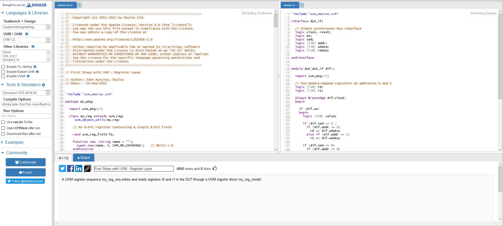

###################
EDA Playground Help
###################

***********
Quick Start
***********

#. `Log in <http://eda-playground.readthedocs.io/en/latest/login.html>`_. Click the **Log in** button (top right) Then either

* click on Google or Facebook or 
* register by clicking on 'Register for a full account' (which enables all the simulators on EDA Playground)

#. Select your language from the **Testbench + Design** menu.
#. Select your simulator from the **Tools & Simulators** menu. Using certain simulators will require you to supply `additional identifcation information <http://eda-playground.readthedocs.io/en/latest/login.html>`_.
#. Type in your code in the **testbench** and **design** windows. 
#. Click **Run**. 

| `Tutorial <http://eda-playground.readthedocs.io/en/latest/tutorial.html>_`

***********************
What is EDA Playground?
***********************

EDA Playground gives engineers immediate hands-on exposure to simulating and synthesizing SystemVerilog, Verilog, VHDL, C++/SystemC, and other HDLs. All you need is a web browser. 

* With a simple click, run your code and see console output in real time. 
* View waves for your simulation using `EPWave <http://epwave.readthedocs.org>`_ browser-based wave viewer.
* Save your code snippets ("Playgrounds"). 
* Share your code and simulation results with a web link. Perfect for web forum discussions or emails.
  Great for asking questions or sharing your knowledge.
* Quickly try something out

  * Try out a language feature with a small example.
  * Try out a library that you're thinking of using.

**************************
You can use EDA Playground  
**************************
* for **Quick prototyping** -- try out syntax or a library/language feature.
* when **asking questions on** `Stack Overflow <http://stackoverflow.com/>`_ or other online forums, attach a link to the
  code and simulation results.
* during **technical interviews** to test candidates' SystemVerilog/Verilog coding and debug skills.
* trying out **different verification frameworks**: UVM, SVUnit, plain Verilog, or Python.

***************************************
Support, Feature Requests and Bug Fixes
***************************************

| Support available on `EDA Playground forum <https://groups.google.com/forum/#!forum/eda-playground>`_
| Or open a bug here: https://github.com/edaplayground/eda-playground/issues (requires GitHub account).

*********************
News and Site Updates
*********************
New features are frequently being added to EDA Playground. Follow the updates on your favorite social media site:

* `@EDAPlayground on Twitter <https://twitter.com/edaplayground>`_
* `EDA Playground on Facebook <https://facebook.com/edaplayground>`_

*******
Credits
*******

**EDA Playground** is maintained by `Doulos <http://www.doulos.com>`_.
