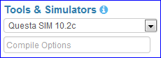

##################
Settings & Buttons
##################

***************
Sidebar Options
***************

EDA Playground provides many options that can be configured for running your code.

.. _languages-libraries-options-label:

Languages & Libraries
=====================

This section allows selection of coding languages and the available libraries for those languages.
Currently, the design (right editor pane) must be Verilog/SystemVerilog.

.. image:: _static/languages_libraries_1.png

.. image:: _static/languages_libraries_2.png

Testbench
---------

The testbench (left editor pane) may be written using one of these languages:

* Verilog/SystemVerilog
* Python 2.7

UVM / OVM
---------

When testbench language is *Verilog/SystemVerilog*, a UVM or OVM library can be used for both the design and testbench.
The following libraries are available:

* UVM 1.1d

Other Libraries
---------------

When testbench language is *Verilog/SystemVerilog*, other Verilog libraries can be used for both the design and testbench.
These libraries may be used along with UVM. Multiple libraries may be selected at the same time.
*Ctrl+Click* to select multiple libraries. Available libraries:

* OVL 2.7
* SVUnit 2.5

Methodology
-----------

When testbench language is *Python 2.7*, the following verification environments are available:

* cocotb 0.3
* cocotb 0.2

.. _tools-simulators-options-label:

Tools & Simulators
==================

For running the code, several tools/simulators may be selected. Many simulators have additional options that may be specified.
Any options needed for languages and libraries will automatically be included.

Icarus Verilog
--------------

.. image:: _static/icarus_verilog.png
   :align: right

Additional command-line *compile options* and *run options* may be specified in the bottom textboxes.

*Icarus Verilog 0.9.7* and *Icarus Verilog 0.9.6* compile options are pre-populated with **-Wall**

*Icarus Verilog 0.10.0* compile options are prepopulated with **-Wall -g2012**

An example of custom compile and run options is here: http://www.edaplayground.com/s/4/202

GPL Cver
--------

Currently, no additional options for this simulator are available.

VeriWell
--------

Currently, no additional options for this simulator are available.

Questa SIM
----------

This simulator will only do the compile step. The run step is currently not available.

Additional command-line *compile options* may be specified in the bottom textbox.

Details
=======

The options in this section are only used when saving the playground.

.. image:: _static/details.png

Name
----

A brief name/title of the playground. Visible by others when they open a saved playground.

Description
-----------

A longer description of the playground. Visible by others when they open a saved playground.

Public
------

Whether this playground should be publicly accessible after being saved. When checked, anyone will be able to
view this playground. When unchecked, only the creator will be able to view the playground.

Examples
========

Links code examples created on EDA Playground. Some examples may have additional documentation provided in the *(docs)* link.

.. image:: _static/examples.png

*******
Buttons
*******

Log In
======

The user must be logged in to **save** or **run** playground code. Playground code and results may be viewed without logging in.

Run
===

Run the current code using the selected tool/simulator and options. The code runs on the EDA Playground server and the results are
printed in the bottom *Results* pane.

Save
====

Save the current playground, including code, bottom 200 lines of results, and options. Once the playground is saved, the page
reloads. The location specified in the address bar is a static link to this playground -- this link can be shared with others.

Update
======

This button shows up for the creator of the saved playground. Clicking on it updates the currently saved playground.
The static link does not change.

Copy
====

This button shows up for everyone when viewing a saved playground. Clicking on it creates a new copy of the current playground.
The copy will be complitely separate from the original, and it will have its own link that can be shared with others.

Share
=====

This button only shows up for saved playgrounds. It displays a modal pop-up with a static link to the current playground.
Also, it displays buttons for sharing on Twitter, Facebook, or LinkedIn.

About
=====

Link to EDA Playground documentation.
