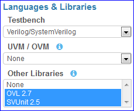
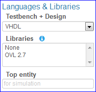
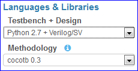
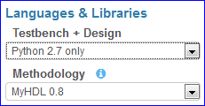
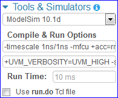
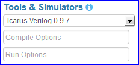
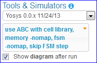
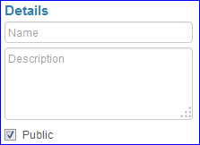
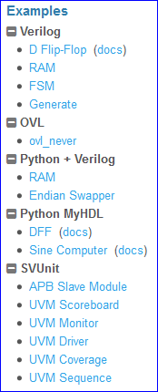

##################
Settings & Buttons
##################

.. _adding-files-label:

************
Adding Files
************

EDA Playground supports up to 10 files. The files may be HDL source files, or text files to be used as inputs to the testbench.

To add a file, click the **+** sign in the testbench or design pane. The filename may not contain special characters.

To rename a file, double click the tab name. (The initial *testbench* and *design* files cannot be renamed.)

.. raw:: html

  <iframe width="1280" height="720" src="//www.youtube.com/embed/Cku5JlN6kQ4?vq=hd720" frameborder="0" allowfullscreen></iframe>

* For *SystemVerilog*, use *include* statements such as the following to include the added source files in the compile:

  ::

     `include "adpcm_seq_item.svh"

* For *VHDL*, all files with the **.vhd** and **.vhdl** extensions are automatically included in the compile.
* For *Python*, use *import* statements:

  .. code:: python

     from design import *

***************
Sidebar Options
***************

EDA Playground provides many options that can be configured for running your code.

.. _languages-libraries-options-label:

Languages & Libraries
=====================

This section allows selection of coding languages and the available libraries for those languages.

Testbench + Design
------------------

The testbench (left editor pane) and design (right editor pane) may be written using one of these languages:

* Verilog/SystemVerilog for both
* VHDL for both
* Python for testbench, and Verilog/SystemVerilog for design
* Python for both

UVM / OVM (SystemVerilog)
-------------------------

When language is *Verilog/SystemVerilog*, a UVM or OVM library can be used for both the design and testbench.
The following libraries are available:

* UVM 1.1d
* OVM 2.1.2

Other Libraries (SystemVerilog/Verilog)
---------------------------------------

When language is *Verilog/SystemVerilog*, other Verilog libraries can be used for both the design and testbench.
These libraries may be used along with UVM/OVM. Multiple libraries may be selected at the same time.
*Ctrl+Click* to select multiple libraries. Available libraries:

* OVL 2.7
* SVUnit 2.5

Libraries (VHDL)
----------------

When language is *VHDL*, the following VHDL libraries can be used for both design and testbench.

* OVL 2.7

Top entity (VHDL)
-----------------

When language is *VHDL*, the top entity of the design must be specified before running a simulation.

Methodology (Python + Verilog or Python only)
---------------------------------------------

When testbench language is *Python* and design language is *Verilog/SystemVerilog*, the following verification environments are available:

* cocotb 0.3
* cocotb 0.2

.. _migen-options-label:

When testbench and design language is *Python*, the following methodologies are available:

* MyHDL 0.8
* Migen X

Migen
^^^^^

Before running synthesis on a Migen design, the *Top class* corresponding to the top module must be specified.
The *Top class* is the class instantiation to use when converting the Migen design to Verilog. Some examples:

* ``MyModule()``
* ``Divisor(4)``
* ``MyMemory(16, 2**12, init=list(range(20)))``

.. _tools-simulators-options-label:

Tools & Simulators
==================

For running the code, several tools/simulators may be selected. Many simulators have additional options that may be specified.
Any options needed for languages and libraries will automatically be included.

Open EPWave after run
---------------------

Checking this option will open EPWave wave viewer in a new window after the simulation run completes (pop-ups must be enabled).
It is available for all simulators that have a run step.

  .. image:: _static/openEpwaveCheckbox.png

Download files after run
------------------------

Checking this option will download the run directory as a ZIP file after the simulation run (pop-ups must be enabled).
The simulation run does not have to be successful for the download to occur. The ZIP file will include all the code files as
well as any generated files such as wave dumps, log files, etc.

  .. image:: _static/downloadFilesCheckbox.png

YouTube video: `How to download code and results from EDA Playground <http://www.youtube.com/watch?v=MZh0-Bz5TwI&hd=1>`_

ModelSim
--------

Additional command-line *compile options* and *run options* may be specified in the bottom textboxes.

ModelSim Compile Options for SystemVerilog/Verilog
^^^^^^^^^^^^^^^^^^^^^^^^^^^^^^^^^^^^^^^^^^^^^^^^^^

For SystemVerilog and Verilog simulations, *ModelSim* compile options are prepopulated with **-timescale 1ns/1ns -mfcu +acc=rmb -sv**

ModelSim Compile Options for VHDL
^^^^^^^^^^^^^^^^^^^^^^^^^^^^^^^^^

For VHDL simulations, *ModelSim* compile options are prepopulated with **-2008**

Icarus Verilog
--------------

Additional command-line *compile options* and *run options* may be specified in the bottom textboxes.

*Icarus Verilog 0.9.7* and *Icarus Verilog 0.9.6* compile options are pre-populated with **-Wall**

*Icarus Verilog 0.10.0* compile options are prepopulated with **-Wall -g2012**

An example of custom compile and run options is here: http://www.edaplayground.com/s/4/202

Note: When using Migen co-simulation, the compile/run options are not available.

GPL Cver
--------

Currently, no additional options for this simulator are available.

VeriWell
--------

Currently, no additional options for this simulator are available.

Python
------

This is a standard Python compiler. It is only used for MyHDL when both testbench and design are written in *Python*.
Currently, no additional options are available for Python.

Yosys
-----

Yosis is a synthesis tool for performing logical synthesis and creating a netlist.
It supports using `ABC <http://www.eecs.berkeley.edu/~alanmi/abc/abc.htm>`_ to synthesize for a sample cell library.

Yosys will only process code in the right *Design* pane. The code in the left *Testbench* pane will be ignored.
UVM/OVM/Methodology/Libraries selections are also ignored.

The following synthesis options are available:

* *use ABC with cell library* - synthesize for a demo cell library using `ABC <http://www.eecs.berkeley.edu/~alanmi/abc/abc.htm>`_
* *memory -nomap* - skip *memory_map* step
* *fsm -nomap* - skip *fsm_map* step
* *skip FSM step*
* *Show diagram after run* - open the generated circuit diagram after synthesis flow completes (pop-ups must be enabled).

When using Yosys with Migen, the *Top class* must be specified, which is used to convert Migen design to Verilog.

When using Yosys with MyHDL, the *Testbench* pane must contain code to convert MyHDL design to a Verilog file.
The Verilog file must have suffix *.v*, and can be named anything EXCEPT *tb_\** or a Verilog reserved keyword. Thus, when running
Yosys on MyHDL code, the *Testbench* code will be run first before synthesis.

VTR
---

Verilog-to-Routing is a complete physical design flow that includes elaboration, logical sysnthesis, FPGA technology mapping,
packing, placement, and routing. The recommended architecture file *k6_frac_N10_mem32K_40nm.xml* is used for the flow.
In addition, route channel width is set at a high *100* to ensure no routing issues with dense designs.

VTR will only process code in the right *Design* pane. The code in the left *Testbench* pane will be ignored.
UVM/OVM/Methodology/Libraries selections are also ignored.
Currently, no additional options are available for VTR.

Currently, VTR cannot be used with MyHDL or Migen.

Details
=======

The options in this section are only used when saving the playground.

Name
----

A brief name/title of the playground. Visible by others when they open a saved playground.

Description
-----------

A longer description of the playground. Visible by others when they open a saved playground.

Public
------

Whether this playground should be publicly accessible after being saved. When checked, anyone will be able to
view this playground. When unchecked, only the creator will be able to view the playground.

Examples
========

Links to code examples created on EDA Playground. Some examples may have additional documentation provided in the *(docs)* link.

****************
Editor Shortcuts
****************

The following editor shortcuts are enabled by default. Note that the shortcuts are different for PC and MAC users. ::

    // For All
    keyMap.basic = {
      "Left": "goCharLeft", "Right": "goCharRight", "Up": "goLineUp", "Down": "goLineDown",
      "End": "goLineEnd", "Home": "goLineStartSmart", "PageUp": "goPageUp", "PageDown": "goPageDown",
      "Delete": "delCharAfter", "Backspace": "delCharBefore", "Tab": "defaultTab", "Shift-Tab": "indentAuto",
      "Enter": "newlineAndIndent", "Insert": "toggleOverwrite"
    };

    // For PC
    keyMap.pcDefault = {
      "Ctrl-A": "selectAll", "Ctrl-D": "deleteLine", "Ctrl-Z": "undo", "Shift-Ctrl-Z": "redo", "Ctrl-Y": "redo",
      "Ctrl-Home": "goDocStart", "Alt-Up": "goDocStart", "Ctrl-End": "goDocEnd", "Ctrl-Down": "goDocEnd",
      "Ctrl-Left": "goGroupLeft", "Ctrl-Right": "goGroupRight", "Alt-Left": "goLineStart", "Alt-Right": "goLineEnd",
      "Ctrl-Backspace": "delGroupBefore", "Ctrl-Delete": "delGroupAfter", "Ctrl-F": "find",
      "Ctrl-G": "findNext", "Shift-Ctrl-G": "findPrev",
      "Ctrl-[": "indentLess", "Ctrl-]": "indentMore",
      fallthrough: "basic"
    };

    // For MAC
    keyMap.macDefault = {
      "Cmd-A": "selectAll", "Cmd-D": "deleteLine", "Cmd-Z": "undo", "Shift-Cmd-Z": "redo", "Cmd-Y": "redo",
      "Cmd-Up": "goDocStart", "Cmd-End": "goDocEnd", "Cmd-Down": "goDocEnd", "Alt-Left": "goGroupLeft",
      "Alt-Right": "goGroupRight", "Cmd-Left": "goLineStart", "Cmd-Right": "goLineEnd", "Alt-Backspace": "delGroupBefore",
      "Ctrl-Alt-Backspace": "delGroupAfter", "Alt-Delete": "delGroupAfter", "Cmd-F": "find",
      "Cmd-G": "findNext", "Shift-Cmd-G": "findPrev",
      "Cmd-[": "indentLess", "Cmd-]": "indentMore",
      fallthrough: ["basic", "emacsy"]
    };
    keyMap.emacsy = {
      "Ctrl-F": "goCharRight", "Ctrl-B": "goCharLeft", "Ctrl-P": "goLineUp", "Ctrl-N": "goLineDown",
      "Alt-F": "goWordRight", "Alt-B": "goWordLeft", "Ctrl-A": "goLineStart", "Ctrl-E": "goLineEnd",
      "Ctrl-V": "goPageDown", "Shift-Ctrl-V": "goPageUp", "Ctrl-D": "delCharAfter", "Ctrl-H": "delCharBefore",
      "Alt-D": "delWordAfter", "Alt-Backspace": "delWordBefore", "Ctrl-K": "killLine", "Ctrl-T": "transposeChars"
    };

*******
Buttons
*******

Log In
======

The user must be logged in to **save** or **run** playground code. Playground code and results may be viewed without logging in.

Run
===

Run the current code using the selected tool/simulator and options. The code runs on the EDA Playground server and the results are
printed in the bottom *Results* pane.

Save
====

Save the current playground, including code, bottom 200 lines of results, and options. Once the playground is saved, the page
reloads. The location specified in the address bar is a static link to this playground -- this link can be shared with others.

If the playground has been saved previously, clicking on *Save* updates the currently saved playground.
The static link does not change.

Copy
====

This button shows up for everyone when viewing a saved playground. Clicking on it creates a new copy of the current playground.
The copy will be complitely separate from the original, and it will have its own link that can be shared with others.

Share
=====

This button only shows up for saved playgrounds. It displays a modal pop-up with a static link to the current playground.
Also, it displays buttons for sharing on Twitter, Facebook, or LinkedIn.

About
=====

Links to EDA Playground documentation (these pages).

Apps
====

Shows links to other apps available on EDA Playground, such as EPWave.
