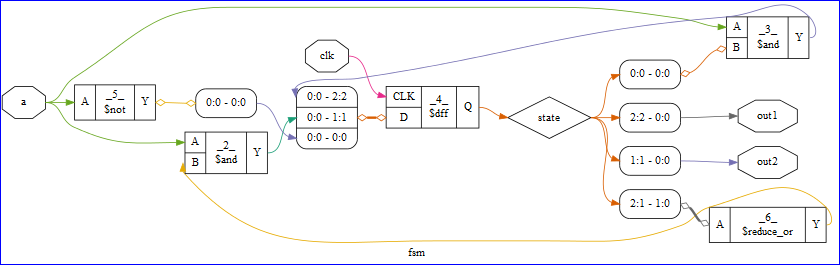

######################
Yosys Circuit Diagrams
######################

The `Yosys <http://www.clifford.at/yosys/>`_ synthesis flow can create circuit diagrams.

* Square boxes are cells. Outputs on the right, inputs and unrecognized ports on the left.
  The first line of text in the box in the cell name, or _<number>_ for internal cells.
  The 2nd line is the cell type. Internal cell types start with a dollar sign.
  (There is a chapter in the manual about the internal cell library used in yosys.)
* Diamond-shaped nodes are wires that are not ports. Octagon-shaped nodes are ports.
* Elliptical nodes are constant drivers. The label has the format <width>'<bits> or simply <number> for 32 bit integers.
* Boxes with round corners with lines such as 0:0 - 42:42 are used to break out and re-combine nets from busses. So for example

  ::

    wire [3:0] a, b;
    wire [7:0] y = {a,b};

  will create the following box:

  .. image:: _static/yosys-diagram.png

  The numbers tell you which bits on which side are connected. for example '3:0 - 7:4' means that the bits
  3:0 from the left net are connected to bits 7:4 from the right net. Usually the box has a single connection
  on one side and individual connections on the other side. When such boxes are connected to each other or to a
  cell port, the connections have little diamonds on the ends instead of arrows. That's because its not an actual
  connection in the sense of the internal RTLIL netlist format.
* For a more detailed explanation, see `Yosys Application Note 011: Interactive Design Investigation <http://www.clifford.at/yosys/files/yosys_appnote_011_design_investigation.pdf>`_
